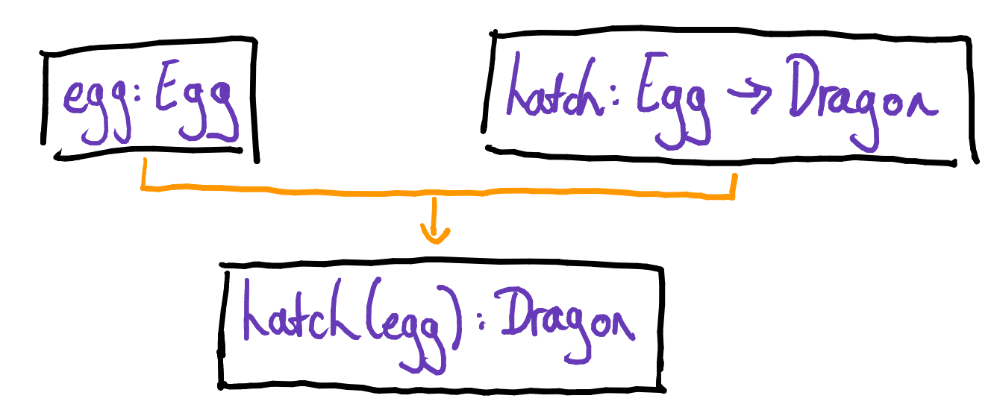

## Proving things that aren't true: a study in soundness
As a mathematics-student-turned-software developer, I’ve spent a lot of time thinking about how my undergraduate studies in mathematics have assisted me to learn software engineering - but it’s less often the case that I get to appreciate how explorations in writing code further my understanding of mathematical concepts I learned in uni.

In the last year or so, my team has been working on a project implemented in Typescript. Having grown accustomed to languages which complain immediately when an undefined property is accessed, initially it was a bit daunting!

Thankfully Typescript’s static typing system has helped a lot in being able to reason about code, and while it makes no pretensions to perfection, I’ve found it fascinating to try and understand what is gained by (intentionally) trading purity for simplicity and/or usefulness.

I find the concept of soundness particularly interesting, having come across it in mathematics before, but not really understanding what it means when programmers use it. (As with many such concepts, I suspect this is partially due to there not being a consistent definition in programming. c.f. "strong typing")

In this post, I’ll aim to attempt to use the mathematical definition as inspiration to interpret the concept of soundness in a statically typed language.

### Soundness in mathematics

The mathematical definition of soundness is as follows:

> A logical system is sound if every statement which has a proof in that system is true.

#### What is a logical system?
In order to understand what we mean by soundness in a mathematical context, we first must familiarise ourselves with the mathematical notion of a logical system.

We start with some set of things _T_ (e.g. the integers). You can think of this as the universe for our system.

We have a _language_ of special symbols in _T_ - these are analogous to keywords in programming.

For example, we might have
* \* - a binary operation we can apply to any two elements of _T_
* _e_ - an identity element
* Standard mathematical symbols like _=_

Combining the elements of T with symbols in the language give us _statements_, such as _x = y * z_.

We also have _axioms_, which are statements we take to be true. These will be the base for proving things in our system. 

For example, you might define a system “Star”, with the language as above and axioms
* _e * x = x = x * e_ for all _x_ in _T_
* _x * (y * z) = (x * y) * z_ for all _x, y, z_ in _T_

We also have rules of inference which provide a way of combining statements that result in new statements.

The basic rule of inference (known as _modus ponens_) is: “if _p_ is true, and _p => q_ (_p_ implies _q_), then _q_ is true” where _p_ and _q_ are statements.

A _proof_ is a combination of statements with the rule of inference to arrive at another statement.

For example, in Star you can prove that the identity _e_ is unique.


#### Truth in a logical system
Logical systems have _models_, which you can think of as an implementation of the system.

We construct a model by taking _T_ to be some concrete set, such as
* the non-negative integers {0, 1, 2...}, or 
* the world of 2 x 2 matrices, or 
* functions that take numbers and return numbers

We then define an implementation of the _language_.

e.g. to construct a model of Star, we just need to define the binary operation * with an identity on a set.

Some examples of models would be:
* _T_ = integers where * is multiplication, _e_ is 1
* _T_ = 2 x 2 matrices where * is matrix multiplication, _e_ is the identity matrix

This leads to the notion of _validity_ (a formal definition of _truth_):
* A statement is _valid_ with respect to a system if it’s true in all models of the system
* A statement is not _valid_ with respect to a system if there exists a model of the system in which that statement is false

e.g. in Star, we can form the statement _x * y = y * x_. This is not valid because, while it might be true in some models, like integers, it’s false in others, like the world of 2 x 2 matrices.


On the other hand, the statement of identity uniqueness that we proved is valid since it's true in all models.

#### Revisiting the definition
Now we have all of the missing pieces we need to understand our earlier definition of soundness; recall:

> A logical system is sound if every statement which has a proof in that system is true.

In the world of mathematics, this seems like a no-brainer. After all, one of the big reasons why we strive so hard to prove things<sup>[1](#f1)</sup> is so that we _know_ that they are true. In fact, as a student of logic the only unsound systems one can concoct are very contrived in nature.

My approach to this has always been to just assume things are sound. But, just as it took a socially isolated lifestyle in the time of a pandemic to appreciate the importance of face to face interactions, experiencing unsoundness in the wild has deepened my understanding of the concept of soundness.

So you can imagine my excitement upon discovering unsoundness naturally arising in programming!

<sup id="f1">[1] One of the first things every budding algebraist has to do is prove that _0 * a = 0_. This can often take several hours or more, and can either be an immensely beautiful and satisfying experience, or induce one to seriously question the life decisions they've made. Or both.</sup>

### Unsoundness in programming

It takes a little work to try and interpret a statically typed language in a similar fashion to what we did above. We have a lot more freedom in the _statements_ we can define; at the most basic level, we have statements like

* Variables have types (e.g. `a` is of type `A`, or `a: A`)
* Functions have types (e.g. `f` is of type `A -> B`, or `f: A -> B`)

Richer languages which seek to usefully capture the way we think about the world permit many different and more complex forms of statement.
* Subtypes are an example of this (e.g. `A` is a subtype of `B`)

In a statically typed language, the type system uses these statements and its rules of inference to _prove_ other statements (e.g. determining the type of the result of a function).

Some of the rules of inference look somewhat familiar, e.g.
If `x: A` and `f: A -> B`, then `f(x): B`.

Here is an example of a simple _proof_ in this system:

```
class Egg {}

class Dragon {}

const hatch = (egg: Egg): Dragon => new Dragon()
```



We can think about a proof as a statement that is deduced by the type system, i.e. a statement known at compile time.

#### Introducing usefulness
To support the richness required to conveniently capture relations and logic in a more intuitive and powerful fashion, languages must use other rules of inference.

For example, if `A` is a subtype of `B`, then we probably want any collection of `A`s to also be a collection of `B`s. In other words, if `Dragon` is a subtype of `Animal`, then `Dragon[]` is a subtype of `Animal[]`.

Seems like a natural property to assume of subtypes, doesn't it?

Given the following code, we can therefore _prove_ that `dragons` is also of type `Animal[]`:

```
class Dragon {}
class Llama {}
type Animal = Dragon | Llama;

const dragons: Dragon[] = [new Dragon()];
```


These rules appear innocuous, but each one expands the logical system so that more statements can be proven. Sometimes this is precisely what you want because the compiler can catch more errors and save us unwelcome surprises at runtime.

But if you prove too many things, it turns out you can end up proving something which isn’t true!

#### Truth in programming
Every time we run a program built upon a system of statements, i.e. the functions, types and constants we define (our _axioms_), we are constructing a _model_ for the system.

Therefore in this case a statement is _valid_ if the statement is true in every program using those definitions.

```
class Egg { colour: string }
class Dragon {}

const hatch = (egg: Egg): Dragon => new Dragon()
```


#### Unsoundness
As we have mentioned previously, expanding the logical system means the compiler can prove lots of things, but the more things proven, the greater the danger is of some of those things being untrue.

This precisely relates to our definition of soundness! 

In other words, something that is unsound is something that can be proved (e.g. the compiler believing “x is of type A”) being untrue (e.g. “x is actually a B” at runtime). You can also think of unsoundness as type errors at runtime that make one think “Hang on, how did the compiler _not_ catch that?!"

Running the below code will result in an error since the compiler _proves_ that `thatsNoDragon` is, in fact, a dragon - but it’s not true!

```
class Dragon {
  breatheFire(): void {
    console.log("Rawr");
  }
}
class Llama {}
type Animal = Dragon | Llama;

const addALlama = (animals: Animal[]): void => {
  animals.push(new Llama());
};

const dragons: Dragon[] = [new Dragon()];
addALlama(dragons);

const thatsNoDragon = dragons[1];
thatsNoDragon.breatheFire();
```

One interesting observation is that the “suspect” part of this code which ultimately leads to unsoundness is the `animals.push()` mutation side effect - another example of how side effects and mathematical reasoning don’t play together nicely!

#### Closing thoughts
So what would it take to make a type system sound? Thinking back to the mathematical side of things, it seems that soundness in mathematics is achievable because we limit what we can express and prove within a system. Therefore any attempt to guarantee soundness must introduce limitations to the system - for example, disallowing use of side effects.

But what if we can’t do that? Let’s return to the specific case of Typescript - a superset of Javascript, which must therefore permit mutation. 

The approach which is used by [Flow](https://flow.org/en/docs/lang/types-and-expressions/) to address this is to simply attempt running the code with multiple possible values and seeing if anything breaks (i.e. creating multiple _models_ to assess validity). This promises additional peace of mind for the price of performance, improving the chances that runtime matches what is proven at compile time.

Depending on the use case, it’s fair to ask if soundness is even desirable. The idea of proving things that aren’t true can be distressing to mathematicians, but as a programmer, sometimes you don’t want to invest too much in protecting against cases which are unlikely to ever occur (in practice would we ever need to add a llama to a collection of dragons?).

Soundness is an explicit non-goal of Typescript, which in some situations trades it off in favour of simplicity and useability. As a user (albeit quite a green one) of the language, I appreciate this sentiment.

Yep, it’s frustrating to spend lots of time trying to debug and fix an error which one feels a more principled type system would permit, but the rewards in productivity can certainly be worth it.

#### Acknowledgement
Thanks to @nadeesha for teaching me an appreciation of Typescript!